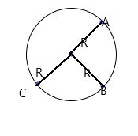
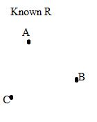
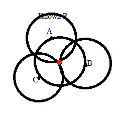
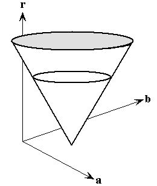
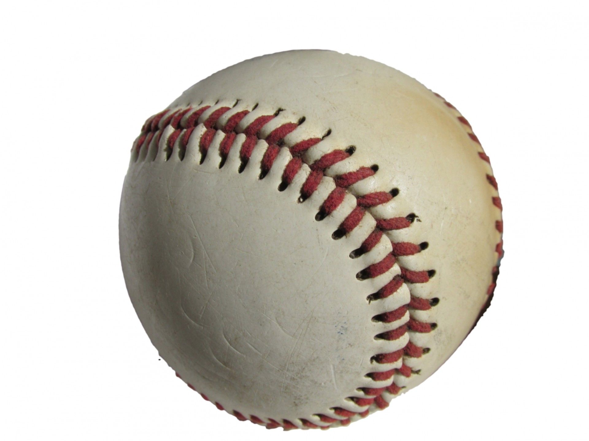
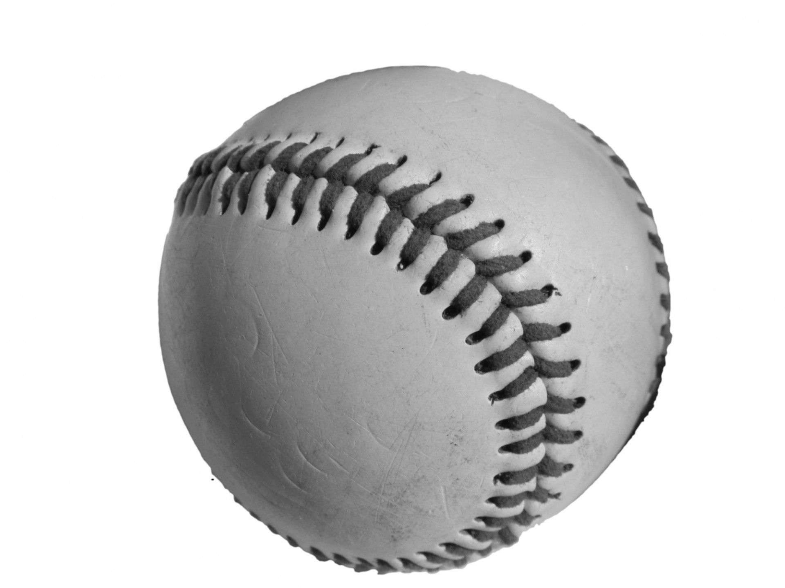
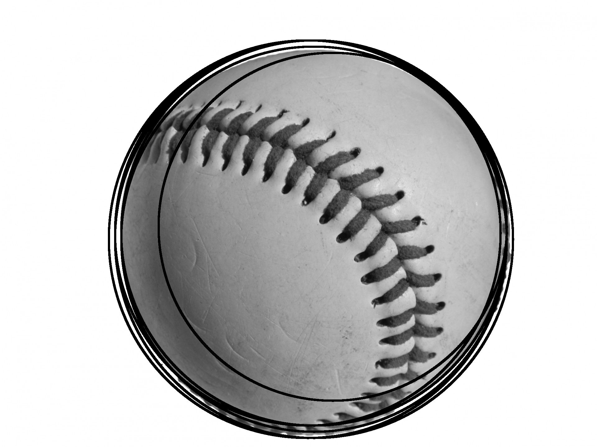
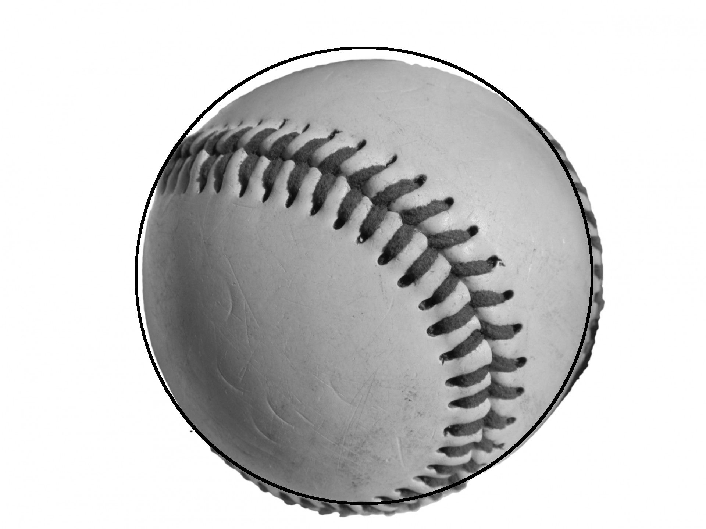

#### Sci 2000 Image Processing Project Report
we are choosing **ball recognition** and **mosaic virus recognition** as term project. This report will contain two parts, **part A** covers our ball recognition and **part B** cover our virus detection. As for convinient for future discussion, here will be a short discription of our **main idea**: In **part A**, we are using **hough transform for circle detection** to recognitize the ball in the given image; In **Part B**, we try to implment **mathmatical morphorlogy operations** to recognize and count the masaic virus in the given microscopy image.
### Part A. circule/ball recognition
This part will first introduce the fundamental of hough transform then walkthrough how we implement it, as well as some challenge in we meet.
**Hough Transform** is one of the famous shape recognition algorithm, It could detect image by transforming image's edge into hough space and finding corresponding feature in hough space. The following will be an **introdcution to hough tansform in circle detection:**	
## Introduction of Hough Transform
1. Let A,B,C be points in the edge of the circle of radius R.
2. Lets assume that we don't know the location of the orginal center of the circle, and we have three points A,B,C and radius R, we are going to find the center of the circle.
3. We could using A,B,C as a center, and constructing three circle with radius R, and we will notice that the edge of there three circle cross at one point, and this point is exactly the center of our original circle. R.

In this example, the circle constrcuted by **A, B, C** is called the circle in the hough space, and their crossing point is the center of the circle A, B, C belong to. In the case that the redius is unknown, one have to construct a 3D hough space to finsh this detection task. **Following is the description:**
1. Let U be a set of nonzore point in the edge map. In order to detect the circle in the image, while the radius is unknown, we constrcute a finite 3D hough space, with x,y plan corresponding to the spatial domain in the original image, and z plane represents the radius domain.
2. For all **r** in Rz(the domain of Z axis), constructe a circle with radius r and center x, for all **x in U**, and draw these circle in the plane of **Z = r**. The following image is an example for one such x in U.
3. Then in the 3d hough space, the if there is a point is the intersection of all such creating circle, then we could say it is the center in the original image. And its coordinate in Hough space, **c = (x,y,z)**, **(x,y)** is the location of the center in the original image and **z** is the radius of such circle.
## Implementation and walk through
In this section, we will go into details about of our implementation. 

As all the given image were in RGB form, we firstly transform the image into **grayscale**. Grayscale preserves all the features of the image, especially the edge, we need to apply the hough transform for circle detection, and it is easier for our algorithm to work with.

Since the given image data with large size larger than 1000 * 1000 pixels, it is impractical to apply our hough transform circle detection in the original image size, as it will take half day to finish one image(time complexity of our hough transform is O(n^3)). One solution for such problem could be using **sampling hough transform**, only take a sample of pixels in the edge map and applying hough transform. On the other hand, one could **downsample** the image to a smaller image. In the case that the balls are large enough in the image(not just a tiny dot), downsampling could help to reduce unecessary noise and keep the main structure of the image at the same time. Downingscaling will be the stategy in our project. Because some images only contain single ball, and some contains large number of balls and all the balls cluster together, we let our downscale ratio to be a flexible parameter in our algorithm, it could be define by user. In our experiment, we are using ratio 15(down scale by 15 times) to run our hough transform.

After downscaling the image, we using **canny edge detector** to extract the edge map from the downscaled image, each nonzero pixels in the edge map are considered to be a point along the circle. In this case, the radius of the circle is unknow, we construct a 3D hough space according to the second description above. In our program, we using a **3d tensor** to represent such hough space. Whenever a circle is generated, the corresponding location in the tensor will incremented by 1. **The range of radius show be ginven by user's best estimate.** It should be represented as the proportion to the longest size(max(height,width)) of the image. If user unwant to give an estimation, it will default set from 0.01 to 0.5. After generating all the possible circles in the image, our algorithm allow user to have two options, choosing the center with most vote or choosing all the centers that greater than a specific threshold. Such threshold is represented by the ratio to the max vote, if user does not specify the thresold, it will set to search for the maximum one. One should notice that our pixels work in discrete space, implying that rounding error could occur. For the same center, the votes will be spread to neighbor pixels, if that center is selected as candidate centers, its neighbor pixels do. Deleting duplicate candidates will be based on the similarity measurement of each candidate center. In our program we firstly **maxmin-scale** the coordinate the radius among all the candidates, then we use **euclidean distance** on the scaled data to detect duplcate and remove them from the list.

Given the validated candidate in the downscaled image, we need to **invert** it back to the original, we inverse the radius by the ration we use in downscale and invert the center to the acenter of the clipped area, and highlight the circle in the grayscale by drawing the circle with the detetcted radius.

To sum up the procedure:
1. transfer RGB to grayscale
2. downscale the image by assigned ratio
3. use canny edge detection to get the edge map
4. convert the pixels in edge map to hough space and find the maximum vote center or center above the given thresold
5. deleting the duplicate center and invert the center and raiuds back to the original scale
6. highlight the circle in the grayscale

Example: now let the  be the image that contain a ball we want to detect
1. transfer to grayscale 
2. downscale the image by ratio 15. 
3. use canny edge detection. 
4. convert the pixel in hough space and get candidate, inverse and highlight, but not delete duplicate. 
5. delete duplicate, inverse and highlight 

One more example, this exmaple will lead us to make some modification in our problem design
1. original image