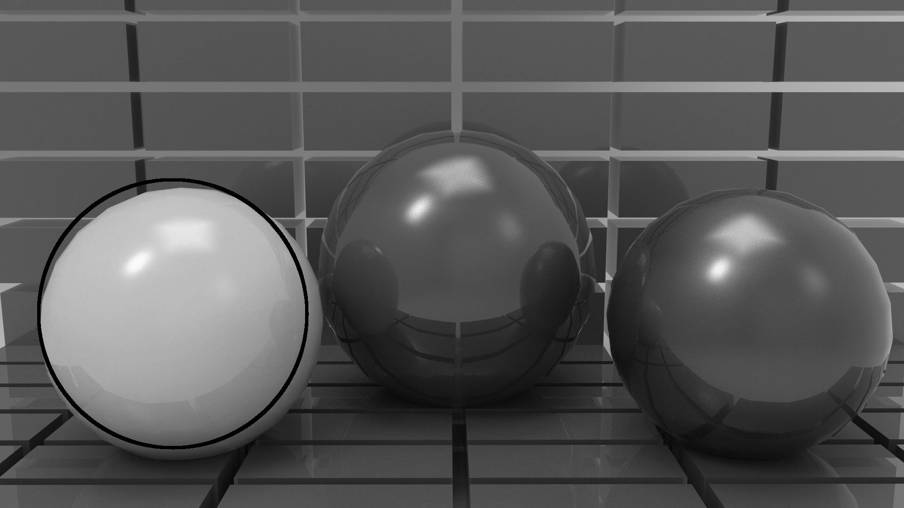

# Sci 2000 Image Processing Project Report
we are choosing **ball recognition** and **mosaic virus recognition** as term project. This report will contain two parts, **part A** covers our ball recognition and **part B** cover our virus detection. As for convenient for future discussion, here will be a short description of our **main idea**: In **part A**, we are using **hough transform for circle detection** to recognize the ball in the given image; In **Part B**, we try to implement **mathmatical morphorlogy operations** to recognize and count the mosaic virus in the given microscopy image.

## Part A. Circle/ball recognition
This part will first introduce the fundamental of hough transform then walk-through how we implement it, as well as some challenge in we meet.
**Hough Transform**[3] is one of the famous shape recognition algorithm, It could detect image by transforming image's edge into hough space and finding corresponding feature in hough space. The following will be an **introdcution to hough tansform in circle detection:**	
### Introduction of Hough Transform
1. Let A,B,C be points in the edge of the circle of radius R.
2. Lets assume that we don't know the location of the original center of the circle, and we have three points A,B,C and radius R, we are going to find the center of the circle.
3. We could using A,B,C as a center, and constructing three circle with radius R, and we will notice that the edge of there three circle cross at one point, and this point is exactly the center of our original circle. R.

In this example, the circle constructed by **A, B, C** is called the circle in the hough space, and their crossing point is the center of the circle A, B, C belong to. In the case that the radius is unknown, one have to construct a 3D hough space to finish this detection task. **Following is the description:**
1. Let U be a set of nonzero point in the edge map. In order to detect the circle in the image, while the radius is unknown, we construct a finite 3D hough space, with x,y plan corresponding to the spatial domain in the original image, and z plane represents the radius domain.
2. For all **r** in Rz(the domain of Z axis), construct a circle with radius r and center x, for all **x in U**, and draw these circle in the plane of **Z = r**. The following image is an example for one such x in U.
3. Then in the 3d hough space, the if there is a point is the intersection of all such creating circle, then we could say it is the center in the original image. And its coordinate in Hough space, **c = (x,y,z)**, **(x,y)** is the location of the center in the original image and **z** is the radius of such circle.
### Implementation and walk through
In this section, we will go into details about of our implementation. 

As all the given image were in RGB form, we firstly transform the image into **grayscale**. Grayscale preserves all the features of the image, especially the edge, we need to apply the hough transform for circle detection, and it is easier for our algorithm to work with.

Since the given image data with large size larger than 1000 * 1000 pixels, it is impractical to apply our hough transform circle detection in the original image size, as it will take half day to finish one image(time complexity of our hough transform is O(n^3)). One solution for such problem could be using **sampling hough transform**, only take a sample of pixels in the edge map and applying hough transform. On the other hand, one could **downsample** the image to a smaller image. In the case that the balls are large enough in the image(not just a tiny dot), downsampling could help to reduce unnecessary noise and keep the main structure of the image at the same time. Downscaling will be the strategy in our project. Because some images only contain single ball, and some contains large number of balls and all the balls cluster together, we let our downscale ratio to be a flexible parameter in our algorithm, it could be define by user. In our experiment, we are using ratio 15(down scale by 15 times) to run our hough transform.

After downscaling the image, we using **canny edge detector** to extract the edge map from the downscaled image, each nonzero pixels in the edge map are considered to be a point along the circle. In this case, the radius of the circle is unknown, we construct a 3D hough space according to the second description above. In our program, we using a **3d tensor** to represent such hough space. Whenever a circle is generated, the corresponding location in the tensor will incremented by 1. **The range of radius show be ginven by user's best estimate.** It should be represented as the proportion to the longest size(max(height,width)) of the image. If user did not give an estimation, it will default set from 0.01 to 0.5. After generating all the possible circles in the image, our algorithm allow user to have two options, choosing the center with most vote or choosing all the centers that greater than a specific threshold. Such threshold is represented by the ratio to the max vote, if user does not specify the threshold, it will set to search for the maximum one. One should notice that our pixels work in discrete space, implying that rounding error could occur. For the same center, the votes will be spread to neighbor pixels, if that center is selected as candidate centers, its neighbor pixels do. Deleting duplicate candidates will be based on the similarity measurement of each candidate center. In our program we firstly **maxmin-scale** the coordinate the radius among all the candidates, then we use **euclidean distance** on the scaled data to detect duplicate and remove them from the list.

Given the validated candidate in the downscaled image, we need to **invert** it back to the original, we inverse the radius by the ratio we use in downscale and invert the center to the center of the clipped area, and highlight the circle in the grayscale by drawing the circle with the detected radius.

To sum up the procedure:
1. transfer RGB to grayscale
2. downscale the image by assigned ratio
3. use canny edge detection to get the edge map
4. convert the pixels in edge map to hough space and find the maximum vote center or center above the given threshold
5. deleting the duplicate center and invert the center and radius back to the original scale
6. highlight the circle in the grayscale

Example: now let the 
 
be the image that contain a ball we want to detect
1. transfer to grayscale 

2. downscale the image by ratio 15. 

3. use canny edge detection. 

4. convert the pixel in hough space and get candidate, inverse and highlight, but not delete duplicate. 

5. delete duplicate, inverse and highlight 

One more example, this example will lead us to make some modification in initial our program
1. original image 

2. grayscale 

3. downsize 

4. edge map

5. last result 

In the above example, our program fails to recognize the blue and red ball. We analyze the **grayscale image** and notice that the **red** and **blue** ball in the gray scale have almost the **same color**, and their color also similar to the wall. While in the original RGB image, their contrast is obvious. As a result, we have to modify our **canny edge detector** to works in RGB image instead of grayscale image. We design canny edge detection to calculate the gradient in **R, G, B channel** separately, then pick the **highest** one as the gradient. And the rest step works the same like what we do in class.
Then our hough transform circular detection algorithm become:
1. downscale the image to preassigned size
2. use RGB **canny detetcion** to detect edge
3. 4. 5. is the same as our hough transform described before
6. highlight the circle in RGB image.

Repeat the last example:
1. original image 

2. downsize

3. edge map

4. highlighted result

From the result above, it is obvious that RGB canndy edge detection perform better than grayscale canny edge detection.

Another challenge we meet is that when the original image contain multiple balls, the edge in different ball sometimes would form a circle by change. As the following image show

The reason is the edge from different circles could also vote for a large circle they could form, and the vote count for these larges circle could be larger than the smaller real circle in the image due to the fact that C = 2\*pi\*r. For example, if a real circle A in the image have radius 3, then the maximum vote for this circle will be around 6\*pi. However, in the case that there are 4 circles with radius 3 in the image, and among their edge, if 3/4 of their edge can joint together and form a larger circle by change, and such circle usually have more votes than the real circle in the image, resulting in a wrong result. To overcome this issue, our program will ask user to give a estimation for the size of circle to be detect in the image.
There is also other solution for these problem, one could increasing the weight of the 3D tensor instead by 1, since C = 2\*pi\*r, increase the vote by 1/r every time could be a good solution for this problem, but it would make the program in favor to the very small circle, every those circles are formed by the edge of background or noise. So to solve problem in this way need more involved in the analysis.

# Part B: Virus Detection
This part of our project is quite different from ball detection. Since the mosaic virus in the image is **small in size**, **various in intensity**, **dense**(in some image), in **irregular shape** and **variuos in orientation**, and the image itself is very noisy due to it is a microscopy image taken from a cell. The hough transform method could not handle this situation well. Instead, we consider working on this problem by using mathematical morphology operation in binary image. This part will contain a brief introduction to some relevant techniques we use in the project and the detail of our project and some walk-through example. 

## Algorithm used
The algorithm we used can be broken down into **6 steps**.

### Step 0: Preprocessing
The image need to be processed by removing some part of the image, the part where that is not relevant.

### Step 1: Contrast Limit Adaptive Histogram Equalizer (CLAHE) 
To understand CLAHE, we must first introduce **Histogram Equalizer**.[1]
#### Histogram Equalizer
This method helps increase to contrast of the whole image, this is useful when both 
the background and the foreground colors are very close.
If we visualize the image color in a histogram in figure (1), where X-axis represent the pixel color value, and Y-axis represent the number of pixel with that color.
We can see that the most of the pixel are clumped up inside a certain range.

Figure 1: *The histograme that represent the image*

After using histogram equalizer, the image color will be redistribute and increase contrast in the original image in figure 2.

Figure 2: *After applying Histogram Equalizer*

#### Adaptive Histogram Equalizer [2]
Since the brightness of the image is different in different region of the image, we use Adaptive Histogram Equalizer, which compute several histogram in different region of the image and redistribute the colors for every pixel and a square region of neighbor around them.

Figure 3: *Chossing region to apply AHE*

#### Contrast Limited AHE
Unfortunately, AHE comes with drawback. AHE tends to amplify noise, because when AHE is computing in a solid color region, noise in that region will be amplified.
To solve this problem, we use a variant of AHE, CLAHE, we set a predefined limit when computing, which will limit the contrast amplified.
#### Implementation
Since CLAHE is very complex, we cannot implment it, instead we use other program(imageJ) to help use get an CLAHE image.

### Step 2: Binarization using adaptive thresholding
#### Normal Thresholding
After CLAHE, the image now have a better contrast, but noise is still a problem, therefore we cannot use canny edge detection for finding virus, instead will will convert the image into binary image with only black and white, 1 and 0 with adaptive thresholding. 
Convert the image into binary image will help us differentiate the background and the foreground
with noise having little impact on our resulting image.

Normal thresholding method are implemented by iterating each pixel in the image, if the pixel intensity is above a predefined threshold, the pixel is the foreground and black. If the pixel intensity is below a predefined threshold, the pixel is the background and white.
#### Adaptive Thresholding[4]
Normal thresholding wont be sufficient for our case, because in our CLAHE step, the contrast is already not even throughout the image, therefore, we should take into account of the uneven contrast and get a good global threshold.

To calculate a good global threshold, we used Iterative selection method:

* We calculate the current threshold by first calculating the mean of a small region.
* We then find all the pixel that is lower than and higher than the previously calculated threshold.
* And we find the mean of all the lower pixel and mean of higher pixel and divide by 2 and this is the threshold for the next iteration.
* If the next threshold does not equal to the current threshold, repeat the above steps.
* If the next threshold is equal to the current threshold, we found our global threshold.

After finding the global threshold, we apply thresholding like normal threshold, and out threshold is done.

The reason we used Iterative selection method, is because.......

### Step 3: Closing disk kernel
After converting our image into binary image, there are still some flaw. There are little spot of noise inside some virus in the image. By using mathematical morphology, we try to eliminate these noise using closing by a generated kernel disk. 
#### Closing
Closing is a operation in mathematical morphology, which can separated into two parts, erosion and dilation. 
This part of our project is quite different from ball detection. Since the mosaic virus in the image is **small in size**, **various in intensity**, **dense**(in some image), in **irregular shape** and **variuos in orientation**, and the image itself is very noisy due to it is a microscopy image taken from a cell. The hough transform method could not handle this situation well. Instead, we consider working on this problem by using mathematical morphology operation in binary image. This part will contain a brief introduction to some relevant techniques we use in the project and the detail of our project and some walk-through example. 

### Step 4: Finding contour map
With the closing by a disk kernel , we successfully convert the image to a great binary image which can be used now.
Next we have to find a contour map.

#### Contour Map
Contour map is a map for a binary image, which we calculate the distance between each pixel of foreground and the closest point of background. By calculating the contour map, we can find the point furthest away from the background, which can help our next step.

### Step 5: Finding local Extrema in contour map
From the contour map, the pixel furthest away from the background is the local extrema of the contour map. 

To find the local extrema of the cell, we first need to find the connected area of the image to identify those area which can potentially be a virus.
The algorithm we used is a depth-first implementation which find the connected area by passing each
pixel in the image.

Steps:

1. First, start from first pixel of the image, loop through all pixel.
2. If the pixel is background, skip to next pixel, if the pixel is the foreground, put it into a list.
3. Inside the list, find the neighbor of the pixel in the list for all element in the list.
4. Label them as connected.

After we label the connected area, we start finding the local extrema, and local extrema will be our starting point for out last step, watershed.
To find the local extrema, we will search for a local extrema within a preassigned radius. The radius we choose is the radius of the kernel disk in step 3 times 2 + 1, this will ensure that the there will be no other local extrema in the radius. 

After finding local extrema,  the count of local extrema will be the number of virus in the image.

### Step 6: Object segmentation by watershed[5]
This step are the extra work that we do, which is not perfect but it show satisfying result for us.
In This step, we try to use watershed technique to separate the cells that are sticking together in the binary image.

## Walk through the whole process
**1. Preprocessing :**

**2. Performing CLAHE :**

**3. Binary image by adaptive threshold :**

**4. Closing by disk kernel (erosion) :**

**5. Closing by disk kernel (Dilation) :**

**6. Contour map :**

**7. finding local extrema :**

**8. Watershed :**

## Limitation and Drawback
* Although we successfully count the number of virus, the image we used are still modified before using our algorithm. We have to hide part of the image that is closely resemble the virus.
* Since out method require some preassigned number and modification before use, we can not automate our process.
* These method only work on this specific virus, try to detect virus that is different in appearance will not work.

 
 
 
 
 
 

#### Contribution composition
**Wei Yidong**: hough transform, watershed, contour map, local extrema, part A of the report

**Lui Hoyat**: rgb canny edge detection, adaptive thresholding, CLAHE, part B of the report

**Together**: Mathemetical morphology

 
 

### Reference
1. Wikipedia contributors. (2019, October 24). Histogram equalization. In Wikipedia, The Free Encyclopedia. Retrieved 20:47, December 4, 2019, from https://en.wikipedia.org/w/index.php?title=Histogram_equalization&oldid=922759298
2. Wikipedia contributors. (2019, July 26). Adaptive histogram equalization. In Wikipedia, The Free Encyclopedia. Retrieved 20:45, December 4, 2019, from https://en.wikipedia.org/w/index.php?title=Adaptive_histogram_equalization&oldid=907909958
3. Yuen, H. K., Princen, J., Illingworth, J., & Kittler, J. (2003, June 10). Comparative study of Hough Transform methods for circle finding. Retrieved from https://www.sciencedirect.com/science/article/pii/026288569090059E.
4. Ridler, TW & Calvard, S (1978), "Picture thresholding using an iterative selection method", IEEE Transactions on Systems, Man and Cybernetics 8: 630-632
5. A. S. Kornilov, I. V. Safonov, ”An Overview of Watershed Algorithm Implementations in Open Source Libraries”, Journal of Imaging, vol.4, 123, 2018.
 
